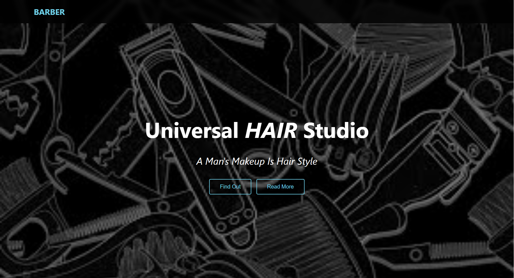
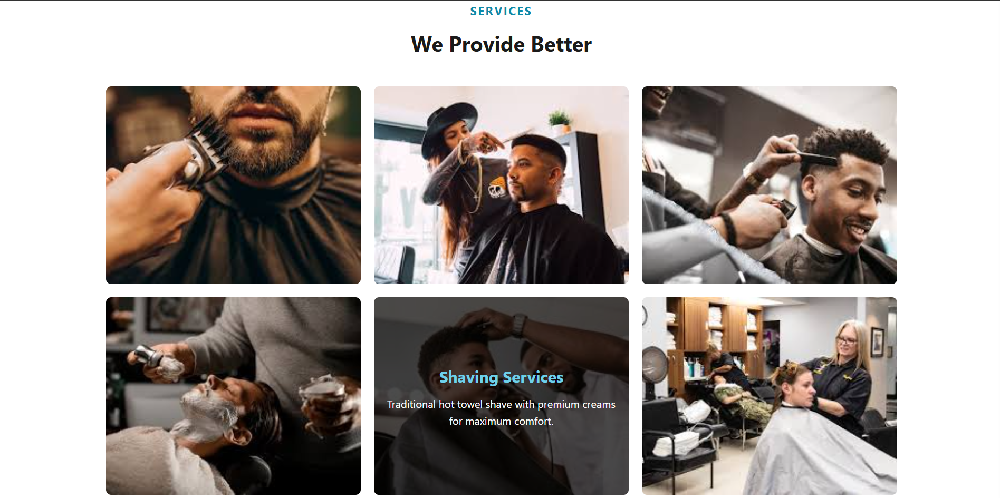
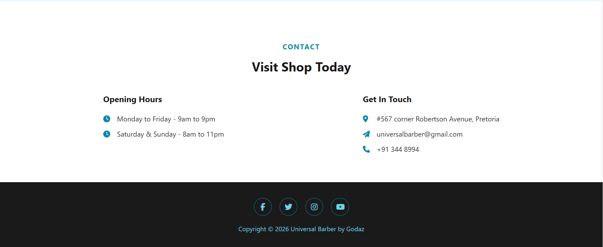

# 💈 Universal Barber Studio Website

A modern responsive barber shop website built using **HTML, CSS, and Font Awesome**.

## 🚀 Live Features
- Responsive Navigation Menu
- Hero Landing Section
- Features Showcase
- Services Gallery
- Client Testimonials
- Contact Information Section

## 🛠️ Tech Stack
- HTML5
- CSS3
- Font Awesome Icons

## 📸 Website Screenshots

  
  

  
  

  

---

## 👨‍💻 Author

**Godaz / Takunda Gorogodo**

---

## 📜 License

This project is open-source and free to use.
